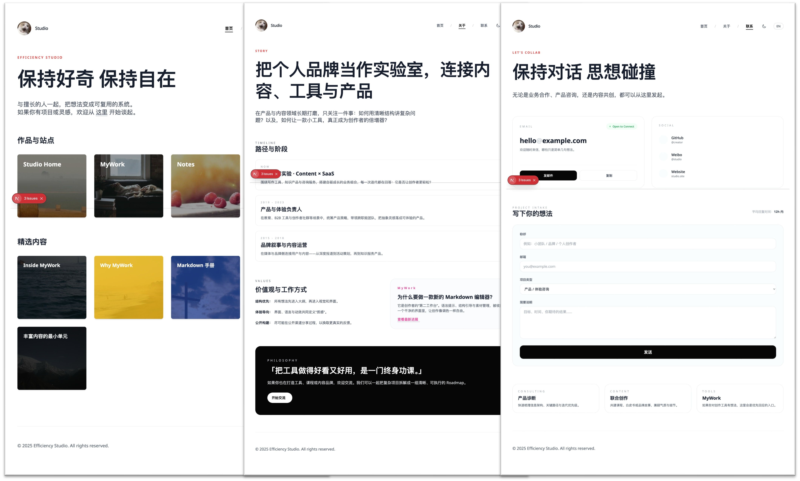
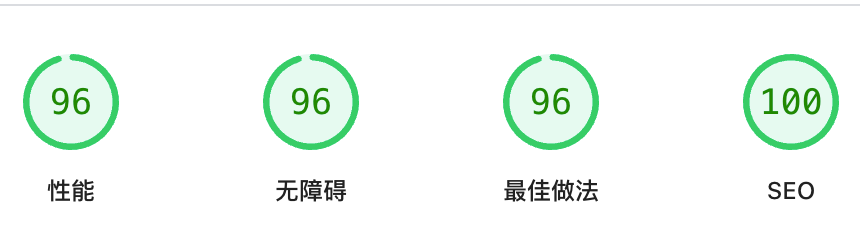
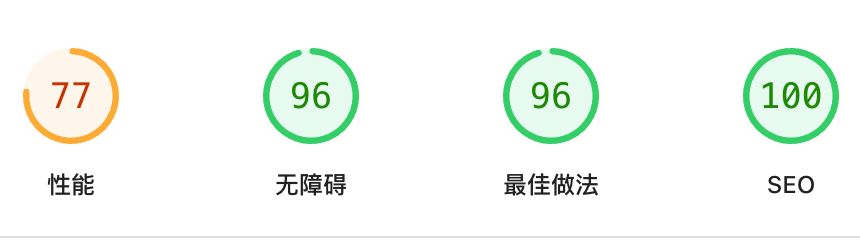

# Simple Portfolio

[English](README.md) | [中文](README_zh.md)

A simple, responsive personal portfolio website built with **Next.js** and **Tailwind CSS**.

## Preview



## Lighthouse PageSpeed Insights

### Desktop

[](https://pagespeed.web.dev/analysis/https-www-wenjiexu-site/b7dpi427wf?form_factor=desktop)

Run the test yourself: [Google Lighthouse PageSpeed Insights](https://pagespeed.web.dev/analysis/https-www-wenjiexu-site/b7dpi427wf?form_factor=desktop)

### Mobile

[](https://pagespeed.web.dev/analysis/https-www-wenjiexu-site/b7dpi427wf?form_factor=mobile)

Run the test yourself: [Google Lighthouse PageSpeed Insights](https://pagespeed.web.dev/analysis/https-www-wenjiexu-site/b7dpi427wf?form_factor=mobile)

## Project Structure

```text
src/
├── app/                 # Next.js App Router
│   ├── (main)/          # Main route group (with Header/Footer)
│   │   ├── about/       # About page
│   │   ├── contact/     # Contact page
│   │   └── page.jsx     # Home page
│   ├── globals.css      # Global styles
│   ├── layout.jsx       # Root layout (Providers only)
│   └── not-found.jsx    # 404 page (Isolated layout)
├── components/
│   ├── About.jsx        # About section component
│   ├── App.jsx          # Main App component (Legacy/Refactored)
│   ├── Contact.jsx      # Contact section component
│   ├── HeaderBar.jsx    # Navigation Bar
│   ├── Hero.jsx         # Hero section
│   ├── Layout.jsx       # Main Layout wrapper
│   └── ...
├── lib/                 # Utilities and Contexts
│   ├── LanguageContext.jsx
│   └── ThemeContext.jsx
├── locales/             # Language Configuration
│   ├── config.js        # Locale configuration
│   ├── en.json          # English content
│   └── zh.json          # Chinese content
└── styles/              # Additional styles
```

## Development

1. **Install dependencies**:

   ```bash
   npm install
   ```

2. **Run development server**:

   ```bash
   npm run dev
   ```

   Open [http://localhost:3000](http://localhost:3000) to view it in the browser.

## Build & Deploy

To create a production build (static export):

```bash
npm run build
```

The static files will be generated in the `out/` directory.

## Configuration

- **Content**: Edit files in `src/locales/` (`zh.json`, `en.json`) to update site content (text, links, images).
- **Environment Variables**:
  - Create a `.env` file based on `.env.example` (if available) or add your keys directly.
  - Required for Contact Form:
    - `NEXT_PUBLIC_EMAILJS_SERVICE_ID`
    - `NEXT_PUBLIC_EMAILJS_TEMPLATE_ID`
    - `NEXT_PUBLIC_EMAILJS_PUBLIC_KEY`
  - Optional for Google Analytics:
    - `NEXT_PUBLIC_GA_ID` (e.g., `G-XXXXXXXXXX`)

## License

This project is licensed under the MIT License. See the [LICENSE](LICENSE) file for details.
